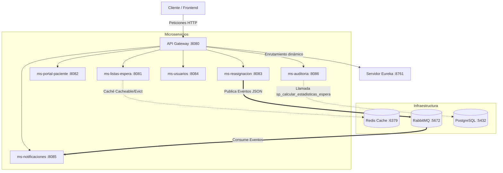

# Plataforma RedNorte Backend 🏥

RedNorte es una solución integral y escalable orientada a microservicios diseñada para optimizar y gestionar las listas de espera hospitalarias en tiempo real. Este repositorio alberga el backend de la plataforma, implementado bajo estándares rigurosos de nivel de producción utilizando **Spring Boot 3.x**, **Java 21**, **Spring Cloud**, **Redis**, **RabbitMQ**, **PostgreSQL** y **JaCoCo**.

---

## 🏗️ Arquitectura del Sistema

El ecosistema está constituido por una pasarela de entrada (API Gateway), un servidor de descubrimiento y 6 microservicios especializados y desacoplados:



---

## 📦 Detalle de Componentes y Microservicios

### 1. 🔍 Servidor de Descubrimiento (`eureka-server`)
* **Puerto**: `8761`
* **Tecnología**: Spring Cloud Netflix Eureka.
* **Propósito**: Registro dinámico de todas las instancias de microservicios, facilitando el balanceo de carga en el Gateway y el desacoplamiento de IPs y puertos físicos.

### 2. 🛡️ API Gateway (`api-gateway`)
* **Puerto**: `8080`
* **Tecnología**: Spring Cloud Gateway, Reactive WebFlux, JJWT (v0.12.6).
* **Propósito**: Punto de entrada único para todos los clientes.
* **Características Clave**:
  - Enrutamiento dinámico y balanceo de carga entre microservicios registrados en Eureka.
  - Filtro de seguridad global (`JwtAuthFilter`) que valida tokens JWT y añade encabezados de usuario (`X-User-Name`, `X-User-Role`) a las peticiones descendentes.
  - Firma criptográfica rigurosa mediante HMAC SHA-256 (`Keys.hmacShaKeyFor`) y expiración estricta de tokens fijada en exactamente 1 hora (3600000 ms).
  - Exclusiones de seguridad públicas para `/auth/login`, `/eureka` y la documentación unificada de **Swagger UI** (`/swagger-ui.html`, `/swagger-ui/**`, `/v3/api-docs/**`, `/swagger-resources/**`, `/webjars/**`).

### 3. 📋 Gestión de Listas de Espera (`ms-listas-espera`)
* **Puerto**: `8081`
* **Tecnología**: Spring WebMvc, Spring Data JPA, Redis.
* **Propósito**: Administrar el flujo de registro, asignación y priorización de atenciones médicas.
* **Características Clave**:
  - **Patrón Factory Method**: Instanciación polimórfica de atenciones (`AtencionCirugia`, `AtencionConsulta`, `AtencionEmergencia`) según el tipo de solicitud.
  - **Integración de Caché (Redis)**: Cacheo dinámico del listado de espera (`@Cacheable(value = "listasEspera")`) y políticas de invalidación inmediata (`@CacheEvict`) ante cualquier modificación o registro, asegurando coherencia absoluta para el personal médico.
  - **Manejo Global de Excepciones**: Implementación de `@RestControllerAdvice` con la clase DTO estructurada `ErrorResponse` (`timestamp`, `status`, `error`, `message`, `path`) y excepciones de negocio personalizadas como `ResourceNotFoundException`.
  - Documentación técnica exhaustiva mediante etiquetas JavaDoc en controladores y servicios.

### 4. 🔄 Reasignación de Turnos (`ms-reasignacion`)
* **Puerto**: `8083`
* **Tecnología**: Spring WebMvc, Spring Data AMQP (RabbitMQ), Resilience4j.
* **Propósito**: Ejecutar algoritmos de reasignación automática de citas o médicos ante cancelaciones imprevistas.
* **Características Clave**:
  - Tolerancia a fallos configurada a través de Resilience4j (Circuit Breakers y Fallbacks) al invocar otros servicios.
  - Publicación asíncrona de mensajes en formato JSON a la cola RabbitMQ mediante `RabbitTemplate` y `TopicExchange` (`reasignacion.exchange`), notificando las reasignaciones concretadas.

### 5. 🏥 Portal del Paciente (`ms-portal-paciente`)
* **Puerto**: `8082`
* **Tecnología**: Spring WebMvc, Resilience4j, Feign/RestClients.
* **Propósito**: BFF (Backend For Frontend) para centralizar la interacción de los pacientes (consultar estado de sus citas, historial médico e información demográfica).
* **Características Clave**:
  - Encapsulación de llamadas a múltiples microservicios con resiliencia integrada y estrategias de degradación de servicio (Fallbacks).

### 6. 👤 Gestión de Usuarios (`ms-usuarios`)
* **Puerto**: `8084`
* **Tecnología**: Spring WebMvc, Spring Data JPA.
* **Propósito**: Controlar el registro, roles (médicos, administrativos, pacientes) y credenciales demográficas de los usuarios del sistema.

### 7. 🔔 Central de Notificaciones (`ms-notificaciones`)
* **Puerto**: `8085`
* **Tecnología**: Spring Data AMQP (RabbitMQ).
* **Propósito**: Centralizar el envío de alertas y notificaciones críticas.
* **Características Clave**:
  - Listener asíncrono (`NotificationListener`) decorado con `@RabbitListener` que consume eventos de reasignación en formato JSON y procesa simulaciones de envío de emails y alertas por SMS.

### 8. 📊 Auditoría y Estadísticas (`ms-auditoria`)
* **Puerto**: `8086`
* **Tecnología**: Spring WebMvc, Spring Data JPA, PostgreSQL.
* **Propósito**: Mantener trazas y bitácoras de acciones críticas y generar reportes analíticos del hospital.
* **Características Clave**:
  - Invocación de Stored Procedures de PostgreSQL (`sp_calcular_estadisticas_espera`) mediante anotaciones `@Procedure` y consultas nativas optimizadas para recuperar reportes tabulares de rendimiento hospitalario.

---

## 🛠️ Tecnologías y Calidad de Código

* **Java 21** & **Spring Boot 3.3.4 / 4.0.5**
* **JaCoCo (Java Code Coverage)**: Integrado en el ciclo de compilación Maven de cada microservicio, configurado para imponer un estándar mínimo de **85% de cobertura de código** para garantizar la robustez funcional del software antes de ser empaquetado.
* **H2 Console / PostgreSQL**: Configuración dual inteligente. Por defecto, en desarrollo local los servicios corren con la base de datos H2 en memoria (con consola expuesta en `/h2-console`). En entornos de contenedor o producción, se activa el perfil de conexión a PostgreSQL mediante las variables de entorno inyectadas en Docker.
* **OpenAPI / Swagger**:
  - **API Gateway**: Integra `springdoc-openapi-starter-webflux-ui` para servir de agregador reactivo.
  - **Microservicios**: Integran `springdoc-openapi-starter-webmvc-ui` expuesta de forma pública a través del Gateway.

---

## 🚀 Instrucciones de Configuración y Despliegue

### Requisitos Previos
* JDK 21 instalado
* Maven 3.8+ o uso de los wrappers incluidos (`mvnw` / `mvnw.cmd`)
* Docker y Docker Compose instalados

### Paso 1: Levantar la Infraestructura Base (Redis, RabbitMQ, PostgreSQL)
Usa el archivo `docker-compose.yml` provisto en la raíz del proyecto para iniciar las bases de datos y middleware de mensajería:

```bash
docker-compose up -d postgres redis rabbitmq
```

Esto arrancará:
* **PostgreSQL**: Puerto `5432` (Inicializando automáticamente las bases de datos y el procedimiento almacenado definido en `init-databases.sql`).
* **Redis**: Puerto `6379`.
* **RabbitMQ**: Puertos `5672` (mensajería) y `15672` (consola de administración en http://localhost:15672, credenciales por defecto `guest`/`guest`).

### Paso 2: Compilación y Verificación de Cobertura
Para compilar y correr las pruebas de cobertura (JaCoCo) en cualquiera de los microservicios, ejecuta el Maven wrapper del proyecto correspondiente:

```bash
# Ejemplo en el microservicio de listas de espera
cd ms-listas-espera
./mvnw clean compile test
```
Los reportes de cobertura generados por JaCoCo estarán disponibles en `target/site/jacoco/index.html` tras finalizar las pruebas de forma exitosa.

### Paso 3: Lanzar los Servicios
Inicia los servicios en el siguiente orden secuencial para asegurar el correcto registro en Eureka:

1. **`eureka-server`**
2. **`api-gateway`**
3. **Microservicios necesarios** (`ms-listas-espera`, `ms-reasignacion`, etc.)

Puedes correrlos mediante tu IDE favorito o por consola en cada módulo:
```bash
./mvnw spring-boot:run
```

---

## 📈 Endpoint de Documentación OpenAPI

Una vez que el API Gateway y los microservicios estén arriba y registrados en Eureka, puedes visualizar e interactuar con toda la especificación OpenAPI unificada del ecosistema en tu navegador:

🔗 **Swagger UI**: [http://localhost:8080/webjars/swagger-ui/index.html](http://localhost:8080/webjars/swagger-ui/index.html)
