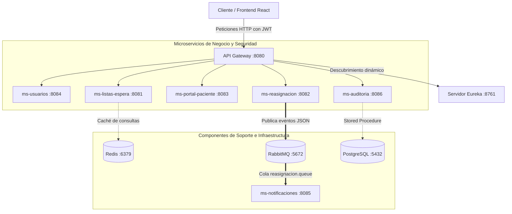

# 🏥 Plataforma Inteligente RedNorte — Documentación Completa del Sistema

Bienvenido a la documentación técnica oficial de la **Plataforma Inteligente RedNorte**. Este documento proporciona un análisis exhaustivo y detallado de cada aspecto del sistema, abarcando su arquitectura de microservicios, base de datos, patrones de diseño aplicados, mecanismos de resiliencia y almacenamiento en caché, flujos de seguridad y estructura del frontend en React.

---

## 🏗️ 1. Arquitectura General del Sistema

La plataforma **RedNorte** está diseñada bajo una arquitectura de **microservicios desacoplados**, utilizando el ecosistema de **Spring Cloud** para el descubrimiento de servicios, balanceo de carga y enrutamiento seguro. El frontend, construido con **React + Vite**, se comunica de forma centralizada a través de un **API Gateway**.

### Diagrama de Arquitectura
El siguiente flujo muestra el ciclo de vida de una petición y la interacción entre los diferentes componentes del ecosistema:



---

## 📦 2. Detalle de Microservicios (Backend)

El backend está desarrollado con **Java 21** y **Spring Boot 3.x**. Cada servicio cumple una función de negocio única e independiente:

### 1. 🔍 [eureka-server](./eureka-server) (Puerto 8761)
* **Propósito:** Actúa como el servidor de descubrimiento (*Service Discovery*).
* **Funcionamiento:** Todos los microservicios se registran en Eureka al arrancar, reportando su IP y puerto dinámicos. Esto permite escalar horizontalmente los servicios de manera transparente.

### 2. 🛡️ [api-gateway](./api-gateway) (Puerto 8080)
* **Propósito:** Punto de entrada único para el cliente.
* **Componentes clave:**
  * [JwtAuthFilter](./api-gateway/src/main/java/com/rednorte/api_gateway/security/JwtAuthFilter.java): Intercepta cada petición HTTP, valida la firma y vigencia del token JWT (usando la clave secreta) y extrae las credenciales.
  * **Mutación de cabeceras:** Agrega los headers `X-User-Name` y `X-User-Role` a las peticiones entrantes antes de reenviarlas a los microservicios de negocio.
  * **Rutas públicas:** Excluye rutas como `/api/v1/auth/**`, `/swagger-ui/**` y ciertos endpoints públicos específicos.

### 3. 📋 [ms-listas-espera](./ms-listas-espera) (Puerto 8081)
* **Propósito:** Gestión principal de pacientes y la lista de espera de atenciones médicas.
* **Tecnologías y Patrones:**
  * **Caché Redis:** Optimización de consultas a la base de datos.
  * **Patrón Factory Method:** Instanciación dinámica de clases según el tipo de atención médica.
  * **Patrón SAGA:** Expone endpoints compensatorios (`/saga/crear`, `/saga/confirmar`, `/saga/cancelar`) para garantizar consistencia eventual.

### 4. 🔄 [ms-reasignacion](./ms-reasignacion) (Puerto 8082)
* **Propósito:** Motor de contingencia de la plataforma. Cuando se libera un cupo por cancelación de cita, este microservicio procesa la reasignación automática al paciente más prioritario en la lista de espera.
* **Resiliencia:** Usa **Resilience4j Circuit Breaker** para protegerse si `ms-listas-espera` cae.
* **Integración asíncrona:** Publica un evento en **RabbitMQ** para notificar al paciente.

### 5. 🏥 [ms-portal-paciente](./ms-portal-paciente) (Puerto 8083)
* **Propósito:** BFF (*Backend For Frontend*) enfocado en la experiencia del paciente. Consolida información de perfiles y orquesta datos históricos consultando a otros microservicios.
* **Resiliencia:** Incorpora Circuit Breaker para responder con gracia (degradación del servicio) en caso de fallos.

### 6. 👤 [ms-usuarios](./ms-usuarios) (Puerto 8084)
* **Propósito:** Registro, autenticación y emisión de tokens de seguridad JWT.
* **Seguridad:** Único microservicio con acceso a las credenciales sensibles cifradas.
* **Inicialización de Datos:** Contiene a [DataInitializer](./ms-usuarios/src/main/java/com/rednorte/ms_usuarios/config/DataInitializer.java), que inyecta roles y usuarios iniciales de demostración en la base de datos si esta se encuentra vacía.

### 7. 🔔 [ms-notificaciones](./ms-notificaciones) (Puerto 8085)
* **Propósito:** Notificación asíncrona a pacientes.
* **Mecanismo:** No expone endpoints REST. Escucha permanentemente la cola de RabbitMQ y simula el envío de correos electrónicos y SMS escribiendo detalles formateados directamente en los logs de la aplicación.

### 8. 📊 [ms-auditoria](./ms-auditoria) (Puerto 8086)
* **Propósito:** Módulo de estadísticas y auditoría hospitalaria.
* **Funcionamiento:** Periódicamente o bajo petición, sincroniza datos de atenciones médicas y ejecuta un procedimiento almacenado nativo para calcular métricas por niveles de prioridad.

---

## 🗄️ 3. Modelo y Persistencia de Datos

El sistema utiliza **PostgreSQL 15** para los entornos de desarrollo integrados y producción, permitiendo el aislamiento de datos mediante bases de datos individuales por microservicio:

| Base de Datos | Microservicio Propietario | Principales Tablas / Entidades |
|---|---|---|
| `usuarios_db` | `ms-usuarios` | `usuarios` (id, username, password, role, rut) |
| `listas_espera_db` | `ms-listas-espera` | `atenciones`, `pacientes` |
| `reasignacion_db` | `ms-reasignacion` | `reasignaciones` |
| `portal_paciente_db`| `ms-portal-paciente` | `perfiles_pacientes` |
| `notificaciones_db` | `ms-notificaciones` | logs de notificaciones enviadas |
| `auditoria_db` | `ms-auditoria` | `atenciones` (sincronizada), registros de métricas |

### Procedimiento Almacenado de Estadísticas (`sp_calcular_estadisticas_espera`)
Definido en la base de datos `auditoria_db`, este cálculo optimiza la obtención de indicadores al ejecutarse directamente en el motor de base de datos:

```sql
CREATE OR REPLACE FUNCTION sp_calcular_estadisticas_espera()
RETURNS TABLE(prioridad INT, cantidad BIGINT)
LANGUAGE plpgsql
AS $$
BEGIN
    RETURN QUERY
    SELECT a.prioridad, COUNT(*)
    FROM atenciones a
    WHERE a.estado = 'EN_ESPERA'
    GROUP BY a.prioridad;
END;
$$;
```

> [!NOTE]
> Para el entorno de desarrollo local con base de datos H2 en memoria, `ms-auditoria` implementa una consulta alternativa (HQL/JPQL) como fallback automático si la base de datos no soporta el procedimiento nativo de PostgreSQL.

---

## 🚀 4. Mecanismos de Caché y Resiliencia

### ⚡ Caché con Redis
En [ms-listas-espera](./ms-listas-espera), las consultas para obtener la lista de espera ordenada por prioridad son altamente recurrentes. Para mitigar el impacto en la base de datos, se aplica **Spring Cache** configurado con **Redis**:

* **Lectura cacheada (`@Cacheable(value = "listasEspera")`):** Las peticiones sucesivas al endpoint `/api/listas-espera/atenciones/pendientes` recuperan los datos instantáneamente de Redis.
* **Invalidación reactiva (`@CacheEvict(value = "listasEspera", allEntries = true)`):** Cada vez que se registra una nueva atención, se cancela o se cambia su estado, se borra automáticamente la caché para asegurar la coherencia de los datos en tiempo real.

### 🛡️ Circuit Breaker (Resilience4j)
Implementado en `ms-reasignacion` y `ms-portal-paciente` para evitar fallos en cadena (*Cascading Failures*):

* **Estado Abierto/Cerrado:** Si el microservicio `ms-listas-espera` experimenta fallas consecutivas, Resilience4j abre el circuito, desviando las peticiones entrantes al método de fallback de forma inmediata sin sobrecargar el servicio dañado.
* **Políticas de Fallback:**
  * En **Reasignaciones:** Si falla la comunicación, el registro se guarda con estado `"FALLIDA"` y observaciones del error, permitiendo reintentar el proceso manualmente una vez restablecido el sistema.
  * En **Portal Paciente:** Retorna una respuesta amigable al usuario indicando que el servicio no está disponible de momento.

### ✉️ Mensajería Asíncrona (RabbitMQ)
Para evitar que el usuario espere a que se procese el envío de notificaciones (operación bloqueante), la reasignación exitosa gatilla un evento asíncrono hacia **RabbitMQ**:

* **Exchange:** `reasignacion.exchange` (de tipo Direct).
* **Queue:** `reasignacion.queue` enlazado con la routing key `reasignacion.key`.
* **Consumidor:** `ms-notificaciones` procesa el mensaje de manera distribuida.

---

## 🔑 5. Flujo de Autenticación y Autorización (JWT)

La seguridad está basada en tokens **JWT (JSON Web Tokens)** con firma HMAC SHA-256:

### Roles y Permisos del Sistema

El sistema cuenta con un control de acceso basado en roles (**RBAC**):

1. **`ROLE_PACIENTE`**: Acceso exclusivo a su propio portal de citas (`/app/paciente`) para consultar derivaciones, recetas y estados de prioridad.
2. **`ROLE_MEDICO`**: Acceso a la consola clínica de lista de espera (`/app/medico`) para visualizar pacientes y confirmar atenciones.
3. **`ROLE_ADMIN`**: Acceso total sin restricciones, incluyendo la consola de administración (`/app/admin`) donde monitorea el historial de reasignaciones y errores del sistema.

---

## 🎨 6. Patrones de Diseño de Software Aplicados

El desarrollo del sistema ha seguido estrictamente buenas prácticas y patrones de software reconocidos:

* **Factory Method Pattern (Creacional):** Implementado en [AtencionFactory](./ms-listas-espera/src/main/java/com/rednorte/ms_listas_espera/entity/AtencionFactory.java) (`ms-listas-espera`). Instancia dinámicamente objetos de tipo `AtencionConsulta`, `AtencionCirugia` o `AtencionEmergencia` a partir de un parámetro String.
* **BFF (Backend For Frontend):** Implementado en `ms-portal-paciente`. Actúa como un proxy inteligente y orquestador que consume múltiples endpoints del backend clínico para armar un payload óptimo y unificado para la interfaz del usuario.
* **SAGA Pattern (Comportamiento/Transaccional):** Implementado para coordinar transacciones distribuidas en la asignación de pacientes sin utilizar bloqueos de bases de datos de dos fases (2PC). Ofrece consistencia eventual en el flujo transaccional.
* **Container / Presenter Pattern (Frontend):** En la app React, los contenedores (`/containers`) manejan el estado, efectos de carga y llamadas HTTP, mientras que los presentadores (`/components`) se limitan a pintar la interfaz gráfica de forma pura a través de props.

---

## 💻 7. Aplicación Frontend (React + Vite)

El frontend está desarrollado con **React**, **TypeScript** y **Vite**, y está configurado en **Library Mode** para poder exportar componentes empaquetados si se requiere.

### Estructura de Archivos Clave
* [App.tsx](../RedNorte-frontend/src/App.tsx): Rutas de React Router y HOCs de protección.
* [main.css](../RedNorte-frontend/src/styles/main.css): Sistema de diseño HSL y variables de CSS premium.
* [useListasEspera.tsx](../RedNorte-frontend/src/hooks/useListasEspera.tsx): Contexto global y Hooks para autenticación y llamadas API.
* [api.ts](../RedNorte-frontend/src/services/api.ts): Configuración de Axios con interceptores JWT.

### Sistema de Diseño (HSL y Temas)
El archivo `main.css` define variables HSL personalizadas para soportar un tema claro y oscuro dinámico:
* **Tema Claro:** Colores limpios basados en azules hospitalarios y grises suaves.
* **Tema Oscuro (`[data-theme="dark"]`):** Interfaz relajante para uso nocturno clínico, activable mediante atributos de DOM.
* **Clases Utilidad:** Clases predefinidas (`rn-card`, `rn-btn-primary`, `rn-table`, `rn-badge`) que evitan el uso de estilos inline ad-hoc y garantizan coherencia visual premium.

---

## 🛠️ 8. Despliegue y Pruebas del Sistema

### Despliegue con Docker Compose
La infraestructura requerida y los microservicios se orquestan mediante [docker-compose.yml](./docker-compose.yml):

```bash
# Levantar el entorno completo (Infraestructura + Microservicios)
docker-compose up -d
```

#### Puertos y Credenciales por Defecto:
* **PostgreSQL:** Puerto `5432` | Usuario: `postgres` | Contraseña: `password`
* **Redis:** Puerto `6379`
* **RabbitMQ:** Puerto `5672` (mensajería) | Puerto `15672` (consola de administración)
* **Eureka Dashboard:** `http://localhost:8761`
* **Swagger UI (OpenAPI):** `http://localhost:8080/webjars/swagger-ui/index.html` (Vía API Gateway)
* **Frontend Local:** `http://localhost:5173`

### Cobertura de Pruebas
Ambos proyectos (backend y frontend) están protegidos con estrictas reglas de calidad que garantizan una cobertura de código **≥ 85%**:

* **Backend (JaCoCo):**
  ```bash
  mvn clean verify
  # Reportes generados en target/site/jacoco/index.html de cada microservicio
  ```
* **Frontend (Vitest):**
  ```bash
  npm run test:coverage
  # Umbrales mínimos configurados en vite.config.ts para lines, statements y branches
  ```

---

## 👥 9. Usuarios de Prueba Pre-cargados
Para verificar el comportamiento de los distintos perfiles de acceso:

| Nombre de Usuario | Contraseña | Rol Asignado | RUT de Paciente Asignado |
|---|---|---|---|
| `admin` | `admin123` | `ROLE_ADMIN` | `N/A` |
| `medico` | `medico123` | `ROLE_MEDICO` | `N/A` |
| `paciente` | `paciente123` | `ROLE_PACIENTE` | `12345678-9` |

---
*Fin del documento de especificación técnica de la plataforma RedNorte.*
